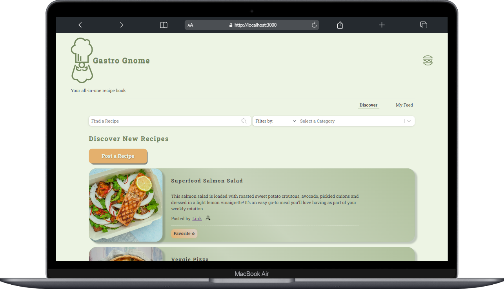
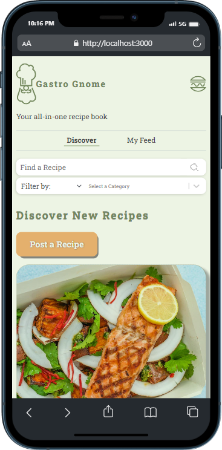
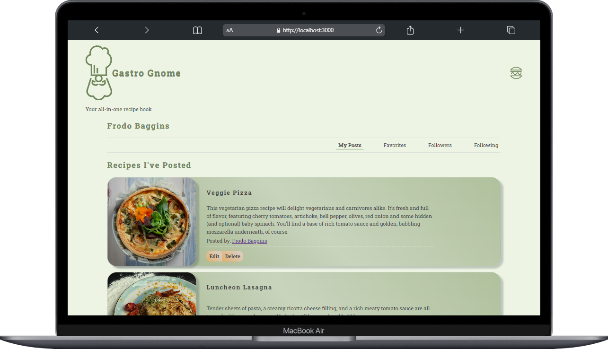
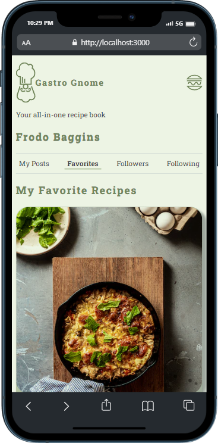
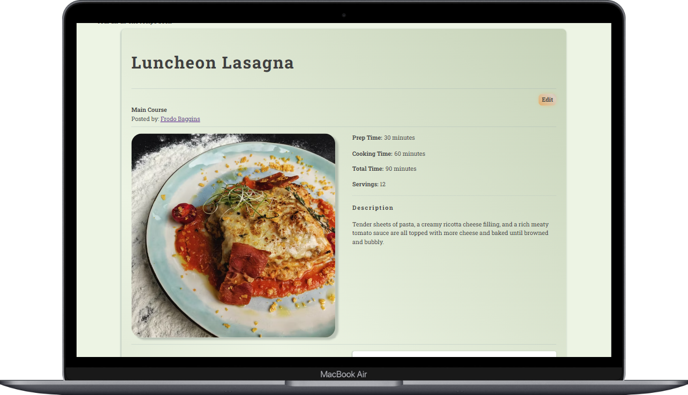
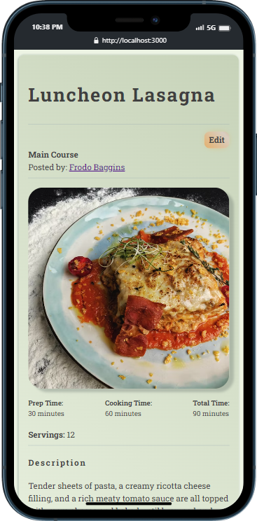
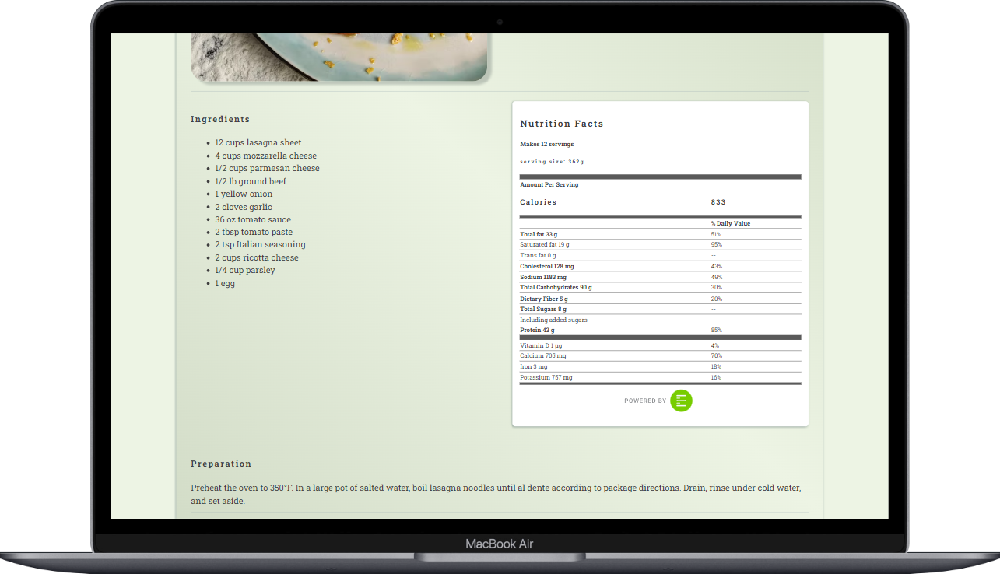
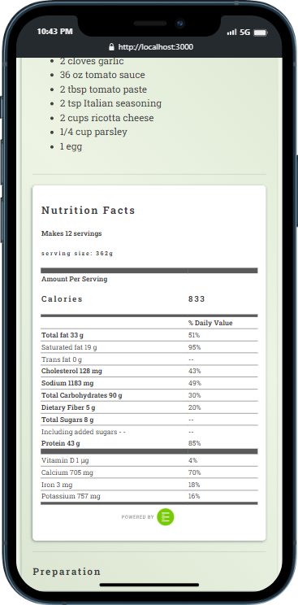
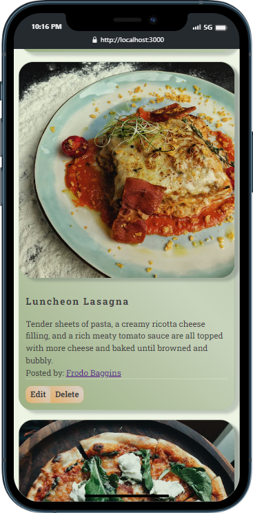

 # Gastro Gnome

Gastro Gnome is an application intended for the true _gastronomes_ where users can discover, collect, and share their favorite recipes using an intuitive UI. The application is built with [Next.js](https://nextjs.org/) app router, a [Python/Django backend](https://github.com/ryanmphill/gastro-django-server) and interfaces with a [third party API](https://www.edamam.com/) to display a nutrition profile for each recipe.





## Getting Started

1. Make sure you have Node.js and npm installed on your machine. Pull down the this (client side) repository and install dependencies.

```bash
npm install
```

2. Pull down the [server side repository](https://github.com/ryanmphill/gastro-django-server)

If cloning via SSH:

```bash
git clone git@github.com:ryanmphill/gastro-django-server.git
```

3. In the server side directory, install necessary dependencies via [pipenv](https://pipenv.pypa.io/en/latest/) and start the virtual environment:

```bash
pipenv shell
```

4. Start up a local web server for the API. It should automatically listen on port 8000

```bash
python3 manage.py runserver
```

5. If you want to use the [Edamam API](https://www.edamam.com/) locally, you will need to create an account to get an id and key. Make a `.env.local` file in the root directory of the client side project, and add the following:

```bash
EDAMAM_ID = "<PASTE ID HERE>"
EDAMAM_KEY = "<PASTE KEY HERE>"
```

6. If you simply want to demo the project, you can run and preview the build for the best performance. From the root directory of the client side project:

```bash
npm run build
```

Wait for the build to complete and then run:

```bash
npm start
```

Now you should be able to view the project on `http://localhost:3000`

**Note**: If you want to preview live changes while making edits to the project, you can run in development mode. Just know that route changes will take more time to load this way:

```bash
npm run dev
```

## Deployed Project

🚧🚧🚧🚧🚧🚧🚧🚧🚧🚧
Coming soon to `gastro-gnome.com`!

## Screenshots















## Additional Resources

- [Next.js Documentation](https://nextjs.org/docs)
- [React Documentation](https://react.dev/reference/react)

<!-- This is a [Next.js](https://nextjs.org/) project bootstrapped with [`create-next-app`](https://github.com/vercel/next.js/tree/canary/packages/create-next-app).

## Getting Started

First, run the development server:

```bash
npm run dev
# or
yarn dev
# or
pnpm dev
# or
bun dev
```

Open [http://localhost:3000](http://localhost:3000) with your browser to see the result.

You can start editing the page by modifying `app/page.tsx`. The page auto-updates as you edit the file.

This project uses [`next/font`](https://nextjs.org/docs/basic-features/font-optimization) to automatically optimize and load Inter, a custom Google Font.

## Learn More

To learn more about Next.js, take a look at the following resources:

- [Next.js Documentation](https://nextjs.org/docs) - learn about Next.js features and API.
- [Learn Next.js](https://nextjs.org/learn) - an interactive Next.js tutorial.

You can check out [the Next.js GitHub repository](https://github.com/vercel/next.js/) - your feedback and contributions are welcome!

## Deploy on Vercel

The easiest way to deploy your Next.js app is to use the [Vercel Platform](https://vercel.com/new?utm_medium=default-template&filter=next.js&utm_source=create-next-app&utm_campaign=create-next-app-readme) from the creators of Next.js.

Check out our [Next.js deployment documentation](https://nextjs.org/docs/deployment) for more details. -->
